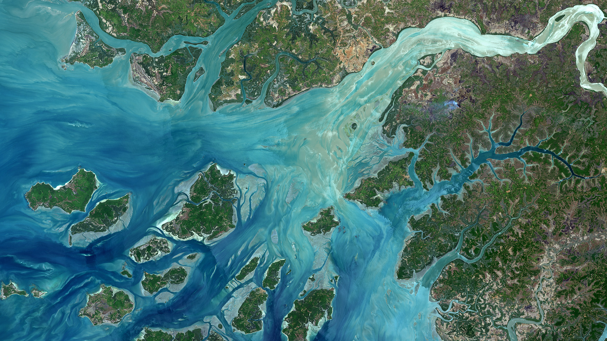

# RS/EO directory - what is it?

The Remote Sensing / Earth Observation directory is just another website (based on 
GitHub pages) where you can find some useful resources in Remote Sensing (RS) & 
Earth Observation (EO). From data sources, learning resources, software and processing 
platforms you can find many potentially useful things! :-D (Almost) everything around 
here is alphabetically arranged so I am not organizing things according to my taste or 
preferences ;-) Let me know if you have suggestions to include here.

 

## Table of contents

- [Searching, visualizing and downloading RS/EO data](#header-1)

  - [Free satellite data](#header-1-1)
    - [Multi-platform](#header-1-1-1)
    - [Landsat](#header-1-1-2)
    - [MODIS](#header-1-1-3)
    - [Sentinel](#header-1-1-4)
  - [Commercial satellite data](#header-1-2)
  - [RS/EO-based data sets/sources and 'high-level' products](#header-1-3)
    - [Digital Elevation/Surface Models](#header-1-3-1)
    - [Forest data layers](#header-1-3-2)
    - [Fused data sets](#header-1-3-3)
    - [Land cover / land use](#header-1-3-4)
    - [Monitoring programmes/initiatives](#header-1-3-5)
    - [Fires](#header-1-3-6)
    - [Surface Temperature](#header-1-3-8)
    - [Multiple themes](#header-1-3-7)
  - [Catalogs and databases of EO missions](#header-1-4)
 

- [Learning RS/EO](#header-2)

  - [Courses](#header-2-1)
  - [Books](#header-2-2)
  - [Other websites](#header-2-3)
 

- [RS & GIS open-source/free software](#header-3)

  - [Free software](#header-3-1)
  - [R packages](#header-3-2)
  - [Commercial software](#header-3-2)
 

- [Cloud-based platforms for EO data processing](#header-4)
  - [Free cloud-based platforms](#header-4-1)
  - [Commercial cloud-based platforms](#header-4-2)

This page is also available in PDF format [link](./index.pdf)

 

## Searching, visualizing and downloading RS/EO data 

-------------------------------------------------------------------------------------------------------------------

 

### Free satellite data 

#### Multi-platform 

. Earth Starts Beating (ESB) Global Mapping Application [link](http://51.38.225.223/earthstartsbeating/)

. EOS Platform [link](https://eos.com/platform/)

. EOS Land Viewer Data Analytics [link](https://lv.eosda.com)

. ESA EOLi (ESA client for Earth Observation Catalogue and Ordering Services / not web-based) [link](https://earth.esa.int/web/guest/eoli)

. NASA Earth Observations (NEO) [link](https://neo.sci.gsfc.nasa.gov)

. NASA EarthData search [link](https://search.earthdata.nasa.gov)

. Planet Explorer Beta [link](https://www.planet.com/explorer)

. Rocket EO data browser [link 1](https://mapshup.com/projects/rocket/#/home) [link 2](https://github.com/jjrom/resto) 

. Sinergise EO Browser [link](http://apps.sentinel-hub.com/eo-browser/)

. USGS EarthExplorer [link](https://earthexplorer.usgs.gov)

. USGS GloVis [link](https://glovis.usgs.gov/)

. Vertex - Alaska Satellite Facility (ASF) Data Portal [link](https://vertex.daac.asf.alaska.edu/)

. Vito Data Portal [link](http://www.vito-eodata.be/PDF/portal/Application.html#Home)

#### Landsat 

. USGS ESPA Landsat data ordering interface [link](https://espa.cr.usgs.gov)

. EarthNow! Landsat Image Viewer [link](https://earthnow.usgs.gov/observer/)

#### MODIS 

. MODIS Web Earth Observation Monitor (webEOM) [link](http://www.earth-observation-monitor.net)

#### Sentinel 

. Awesome Sentinel curated list of Sentinel-related tools, tutorials and API's [link](https://krstn.eu/awesome-Sentinel/)

. BOKU Sentinel-2 data pre-processing service [link](https://s2.boku.eodc.eu)

. ESA SciHub Sentinels Data [link](https://scihub.copernicus.eu/dhus)

. IPSentinel - Sentinel data hub for Portugal [link](https://ipsentinel.ipma.pt/)

. Sentinel-2 World cloudless mosaic browser [link](https://s2maps.eu/)

. Theia/CNES Sentinel-2 data pre-processing service [link](https://theia.cnes.fr/atdistrib/rocket/#/home)

 

### Commercial satellite data 

. Airbus Satellite Imagery [link](http://www.intelligence-airbusds.com/en/65-satellite-imagery)

. ASTRO DIGITAL [link](https://astrodigital.com/)

. DigitalGlobe [link](https://www.digitalglobe.com)

. Planet Labs [link](https://www.planet.com)

. SkyWatch / Techstars [link](https://www.skywatch.co)

. Urthecast [link](https://www.urthecast.com)

 

### RS/EO-based data sets, data sources and 'high-level' products 

#### Digital Elevation/Surface Models 

. ASTER GDEM Elevation data [link 1](https://asterweb.jpl.nasa.gov/gdem.asp) [link 2](http://www.jspacesystems.or.jp/ersdac/GDEM/E/index.html)

. JAXA ALOS Global Digital Surface Model "ALOS World 3D - 30m" (AW3D30) [link](http://www.eorc.jaxa.jp/ALOS/en/aw3d30/)

#### Forest data layers 

. Global 1km Forest Canopy Height ICEsat/GLAS [link](https://webmap.ornl.gov/ogc/dataset.jsp?ds_id=10023)

. Global Forest Cover Change v-1.4 (2000-2016) / U. Maryland [link 1](https://earthenginepartners.appspot.com/science-2013-global-forest/download_v1.4.html) [link 2](https://earthenginepartners.appspot.com/science-2013-global-forest)

. Global PALSAR-2/PALSAR/JERS-1 Mosaic and Forest/Non-Forest map [link](http://www.eorc.jaxa.jp/ALOS/en/palsar_fnf/fnf_index.htm)

. Global Tree Density dataset [link](http://elischolar.library.yale.edu/yale_fes_data/1/)

. JRC Forest cover mapping (1990, 2000 and 2006) [link](http://forest.jrc.ec.europa.eu/activities/forest-mapping)

#### Fused data sets 

. Harmonized Landsat / Sentinel data [link](https://hls.gsfc.nasa.gov/)

#### Land cover / land use 

. GLOBELAND30 (Global Land Cover data at 30m) [link](http://www.globallandcover.com/GLC30Download/index.aspx)

. USGS 30 Meter Global Land Cover [link](https://landcover.usgs.gov/glc/)

#### Monitoring programmes/initiatives 

. Global Forest Watch [link](http://www.globalforestwatch.org)

. Global Land Cover Facility (GLCF) / U Maryland / NASA / GOFC-GOLD [link](http://glcf.umd.edu/data/)

. Global Observation for Forest Cover and Land Dynamics (GOFC-GOLD) [link](http://www.gofcgold.wur.nl)

. USGS Early Warning and Environmental Monitoring Program (EWEM) [link](https://earlywarning.usgs.gov)

#### Fires 

.  Global Fire Emissions Database, Version 4.1 (GFEDv4) [link](https://daac.ornl.gov/VEGETATION/guides/fire_emissions_v4_R1.html)

#### Surface Temperature 

. Sea Surface Temperature [link](https://earthdata.nasa.gov/sea-surface-temperature) 

#### Multiple themes (land cover, vegetation, water, energy, climate, ...) 

. Copernicus Land Monitoring Service and high-level products [link](http://land.copernicus.eu)

. ESA Climate Change Initiative (CCI) / Open Data Portal [link](http://cci.esa.int)

. EarthEnv (global environmental layers for assessing status and trends in biodiversity, ecosystems, and climate) [link](http://www.earthenv.org)

. NOAA/EOG/NCEI (nighttime observations of lights and combustion sources worldwide) [link](https://ngdc.noaa.gov/eog/index.html)

. SEDAAC (Socioeconomic Data and Applications Data Center) datasets (mangroves, fires, urban extent, demography, etc) [link](http://sedac.ciesin.columbia.edu/data/sets/browse)

. WCMC-UNEP datasets (biodiversity, SST, ecoregions, protected areas, mangrove ecosystems, marine species, coral reefs, ...) [link](http://data.unep-wcmc.org/)

 

### Catalogs and databases of EO missions 

. Dept. of Space / Indian Space Research Organization [link](http://www.isro.gov.in/spacecraft/list-of-earth-observation-satellites)

. ESA Satellite Missions Database [link](https://directory.eoportal.org/web/eoportal/satellite-missions)

. Gunter's Space Page (space missions) [link](http://space.skyrocket.de/index.html)

. ITC database of satellites and sensors [link](https://www.itc.nl/Pub/sensordb/AllSensors.aspx)

. NASA missions [link](https://www.nasa.gov/content/earth-missions-list)

. Observing Systems Capability Analysis and Review Tool (OSCAR / WMO) - List of satellites [link](https://www.wmo-sat.info/oscar/satellites)

. Wikipedia List of Earth observation satellites [link](https://www.wikiwand.com/en/List_of_Earth_observation_satellites)

 

## Learning RS/EO 

-------------------------------------------------------------------------------------------------------------------

 

### Courses 

. Australian National University / Water & Landscape dynamics / 
Advanced remote sensing course resources [link](http://www.wenfo.org/wald/advanced-remote-sensing)

. GEO (GIS and Earth Observation) University courses [link](https://www.geo.university/)

. GEO University Earth Engine Course [link](https://www.geo.university/courses/google-earth-engine-for-remote-sensing-and-gis-applications)

. NASA Applied Remote Sensing Training (ARSET) [link](https://arset.gsfc.nasa.gov/)

. ESA course on FutureLearn: _"Earth Observation from Space: the Optical View"_ [link](https://www.futurelearn.com/courses/optical-earth-observation)

. ESA course on _"Radar Remote Sensing"_ at _eo-college_ [link](https://eo-college.org/landingpage/)

. ESA Radar Courses / Earth Online [link](https://earth.esa.int/web/guest/missions/esa-operational-eo-missions/ers/instruments/sar/applications/radar-courses)

 

### Books 

. 2016 . _Land Resources Monitoring, Modeling, and Mapping with Remote Sensing_ [link](https://www.crcpress.com/Land-Resources-Monitoring-Modeling-and-Mapping-with-Remote-Sensing/Thenkabail-PhD/p/book/9781482217957)

. 2016 . _Practical Handbook of Remote Sensing_ [link](https://www.crcpress.com/Practical-Handbook-of-Remote-Sensing/Lavender-Lavender/p/book/9781498704335)

. 2016 . _Remote Sensing and GIS for Ecologists - using Open Source Software_ [link](https://pelagicpublishing.com/products/remote-sensing-and-gis-for-ecologists-wegmann-leutner-dech)

. 2016 . _Remote Sensing of Water Resources, Disasters, and Urban Studies_ [link](https://www.crcpress.com/Remote-Sensing-of-Water-Resources-Disasters-and-Urban-Studies/Thenkabail-PhD/p/book/9781482217919)

. 2016 . _Remotely Sensed Data Characterization, Classification, and Accuracies_ [link](https://www.crcpress.com/Remotely-Sensed-Data-Characterization-Classification-and-Accuracies/Thenkabail-PhD/p/book/9781482217865)

. 2015 . _Remote Sensing Image Fusion_ [link](https://www.crcpress.com/Remote-Sensing-Image-Fusion/Alparone-Aiazzi-Baronti-Garzelli/p/book/9781466587496)

. 2015 . _Remote Sensing Time Series - Revealing Land Surface Dynamics_ [link](http://www.springer.com/br/book/9783319159669)

. 2014 . _Remote Sensing of Natural Resources_ [link](https://www.crcpress.com/Remote-Sensing-of-Natural-Resources/Wang-Weng/p/book/9781466556928)

. 2013 . _Advances in Mapping from Remote Sensor Imagery - Techniques and Applications_ [link](https://www.crcpress.com/Advances-in-Mapping-from-Remote-Sensor-Imagery-Techniques-and-Applications/Yang-Li/p/book/9781138072947)

. 2012 . _Remote Sensing of Land Use and Land Cover: Principles and Applications_ [link](https://www.crcpress.com/Remote-Sensing-of-Land-Use-and-Land-Cover-Principles-and-Applications/Giri/p/book/9781420070743)

. 2011 . _Advances in Environmental Remote Sensing - Sensors, Algorithms, and Applications_ [link](https://www.crcpress.com/Advances-in-Environmental-Remote-Sensing-Sensors-Algorithms-and-Applications/Weng/p/book/9781138072916)

. 2011 . _Introduction to Remote Sensing, Fifth Edition_ [link](https://www.amazon.com/Introduction-Remote-Sensing-Fifth-Campbell/dp/160918176X)

. 2010 . _Remote Sensing for Ecology and Conservation - A Handbook of Techniques_ [link](https://global.oup.com/academic/product/remote-sensing-for-ecology-and-conservation-9780199219957?cc=pt&lang=en&)

. 2008 . _Advances in Land Remote Sensing System, Modeling, Inversion and Application_ [link](http://www.springer.com/la/book/9781402064494)

. 2008 . _Earth Observation of Global Change - The Role of Satellite Remote Sensing in Monitoring the Global Environment_ [link](http://www.springer.com/la/book/9781402063572)

. 2006 . _Remote sensing of the environment: an Earth resource perspective_ [link](https://www.amazon.com/Remote-Sensing-Environment-Resource-Perspective/dp/0131889508/ref=la_B001H6Q89S_1_1?s=books&ie=UTF8&qid=1506998752&sr=1-1)

 

### Tutorials and other useful websites 

. Awesome Sentinel - a curated list of data endpoints, tools for CopernicusEU Sentinel data [link](http://krstn.eu/awesome-Sentinel/)

. Copernicus EU YouTube channel [link](https://www.youtube.com/channel/UCpuwnbuwGG20enAdE50g6TA/videos)

. Data recipes / Alaska Satellite Facility (ASF) [link](https://www.asf.alaska.edu/asf-tutorials/data-recipes)

. ESA EO Open Science YouTube channel [link 1](https://www.youtube.com/channel/UCPnL3aynCQxTOjPttxMiS3Q) [link 2](http://eoopenscience.org/)

. IDB (Index DataBase - database for remote sensing indices) [link](http://www.indexdatabase.de/)

. Intro2Radar by Iain Woodhouse [link](https://www.geos.ed.ac.uk/~ihw/hype/radar/intro2radar.html)

. NASA - "The Electromagnetic Spectrum" website/booklet / Science Mission Directorate [link](https://science.nasa.gov/ems/)

. SAR tutorial/glossary by ESA [link](https://earth.esa.int/handbooks/asar/toc.html)

. SAR tutorial basics [link](http://www.radartutorial.eu/20.airborne/ab07.en.html)

. SAR/EDU - Remote Sensing Education Initiative [link](http://sar-edu.uni-jena.de/wp/)

. Science Education through Earth Observation for High Schools (SEOS) Project tutorials [link](http://lms.seos-project.eu/learning_modules#)

. Tutorial: Fundamentals of Remote Sensing (_Natural Resources Canada_) [link](http://www.nrcan.gc.ca/node/9309)

 

## RS & GIS open-source/free software 

-------------------------------------------------------------------------------------------------------------------

 

### Free software 

. DIVA-GIS [link](http://www.diva-gis.org/)

. E-foto (digital photogrammetric workstation) [link](http://www.efoto.eng.uerj.br/en) 

. EnMAP-Box (software for processing hyper- and multispectral data) [link](http://www.enmap.org/?q=enmapbox)

. ESA SNAP (Sentinel Application Platform) [link](http://step.esa.int/main/toolboxes/snap/)

. ESA SNAP sen2cor (atmospheric correction module) [link](http://step.esa.int/main/third-party-plugins-2/sen2cor/)

. GeoVIS .net (software for photo-interpretation, classification and geo data management) [link](http://www.geovis.net/Downloads.htm)

. GRASS GIS [link](https://grass.osgeo.org/)

. gvSIG [link](http://www.gvsig.com/en/home)

. ILWIS [link](http://52north.org/downloads/category/10-ilwis)

. INTERIMAGE (open-source, knowledge-based framework for automatic image interpretation) [link](http://www.lvc.ele.puc-rio.br/projects/interimage/)

. HyperMixTool (hyperspectral imagery tool) [link](https://sourceforge.net/projects/hypermixtool/)

. MultiSpec (freeware multispectral image data analysis system) [link](https://engineering.purdue.edu/~biehl/MultiSpec/index.html)

. Open Foris Geospatial Toolkit [link](http://www.openforis.org/tools/geospatial-toolkit.html)

. Open Jump (open-source java-based GIS) [link](http://jump-pilot.sourceforge.net/)

. Orfeo Toolbox (OTB) [link 1](https://www.orfeo-toolbox.org/) [link 2](https://github.com/orfeotoolbox) [link 3](https://gitlab.orfeo-toolbox.org/orfeotoolbox/otb)

. Optiks (expandable remote sensing and imagery analysis software platform) [link](https://opticks.org/)

. OSSIM (advanced image processing and geospatial data fusion software) [link](https://trac.osgeo.org/ossim/)

. polSARpro (polarimetric SAR data processing and educational tool) [link 1](https://www.ietr.fr/polsarpro/) [link 2](https://earth.esa.int/web/polsarpro)

. PostGIS (support for geographic objects to the PostgreSQL object-relational database) [link](http://postgis.refractions.net/)

. QuantumGIS [link](http://www.qgis.org/en/site)

. RSGISLib (Remote Sensing and GIS Software Library) [link](http://rsgislib.org/)

. SAGA GIS [link](http://www.saga-gis.org/en/index.html)

. SPIRITS (Software for the Processing and Interpretation of Remotely Sensed Image Time Series) [link](http://spirits.jrc.ec.europa.eu/overview/about/)

. SPRING [link](http://www.dpi.inpe.br/spring/english/)

. TerraView / TerraLib [link](http://www.dpi.inpe.br/terralib5/wiki/doku.php)

. uDig (Java solution for desktop GIS data access, editing, and viewing) [link](http://udig.refractions.net/)

. Whitebox GAT (Geospatial Analysis Tools) [link](http://www.uoguelph.ca/~hydrogeo/Whitebox/)

 

### R packages 

. Acquisition and Processing of MODIS Products (_MODIS_) [link](https://cran.r-project.org/web/packages/MODIS/index.html)

. Bindings for the Geospatial Data Abstraction Library GDAL (_rgdal_) [link](https://cran.r-project.org/web/packages/rgdal/index.html)

. Classes and Methods for Spatial Data (_sp_) [link](https://cran.r-project.org/web/packages/sp/index.html)

. Creating and preprocessing MODIS time series (_MODIStsp_) [link 1](http://ropensci.github.io/MODIStsp/) [link 2](https://github.com/ropensci/MODIStsp)

. Interactive editing of spatial data in R (_mapedit_) [link 1](https://cran.r-project.org/web/packages/mapedit/index.html) [link 2](https://github.com/r-spatial/mapedit)

. Interactive viewing of spatial objects in R (_mapview_) [link 1](https://cran.r-project.org/web/packages/mapview/index.html) [link 2](https://github.com/r-spatial/mapview)

. Interface to Geometry Engine - Open Source GEOS (_rgeos_) [link](https://cran.r-project.org/web/packages/rgeos/index.html)

. Landsat 8 Imagery Rescaled to Reflectance, Radiance and/or Temperature (_landsat8_) [link](https://cran.r-project.org/web/packages/landsat8/index.html)

. MODIS data handling (_MODISTools_) [archive-link](https://cran.rstudio.com/src/contrib/Archive/MODISTools/)

. Radiometric and topographic correction of satellite imagery (_landsat_) [link](https://cran.r-project.org/web/packages/landsat/index.html)

. Geographic Data Analysis and Modeling of raster data (_raster_) [link](https://cran.r-project.org/web/packages/raster/index.html)

. Remote Sensing Toolbox (_RSToolbox_) [link](https://github.com/bleutner/RStoolbox)

. Simple Features for R / Encode and analyze spatial vector data (_sf_) [link 1](https://cran.r-project.org/web/packages/sf/index.html) [link 2](https://github.com/r-spatial/sf)

. Tools for Reading and Handling Spatial Objects (_maptools_) [link](https://cran.r-project.org/web/packages/maptools/index.html)

 

### Commercial software 

. Agisoft PhotoScan (photogrammetric processing of digital images and 3D spatial model generation) [link](http://www.agisoft.com/)

. ESRI ArcGIS [link](http://desktop.arcgis.com/en/)

. Harris Geospatial ENVI [link](http://www.harrisgeospatial.com/ProductsandTechnology/Software/ENVI.aspx)

. Hexagon Geospatial ERDAS IMAGINE [link](http://www.hexagongeospatial.com/products/power-portfolio/erdas-imagine)

. Clark Labs TerrSet/IDRISI [link](https://clarklabs.org/)

. PCI Geomatics [link](http://www.pcigeomatics.com/)

. Trimble eCognition [link](http://www.ecognition.com/)

 

## Cloud-based platforms for EO data processing 

-------------------------------------------------------------------------------------------------------------------

 

### Free cloud-based platforms 

. Google Earth Engine [link 1](https://earthengine.google.com) [link 2](https://explorer.earthengine.google.com) [link 3](https://code.earthengine.google.com/)

. ESA Earth Science Data Cube (ESDC) [link 1](http://earthsystemdatacube.net) [link 2](https://github.com/esa-esdl/cablab-dat) [link 2](https://github.com/esa-esdl/RCABLAB)

. remap (large-scale ecosystem mapping and assessment) [link](https://remap-app.org/)

 

### Commercial cloud-based platforms 

. Descartes Lab [link](https://descarteslabs.com/)

. Raster Foundry [link](https://www.rasterfoundry.com/)

. SpaceAnalyzer [link](https://www.spaceanalyzer.com/)
